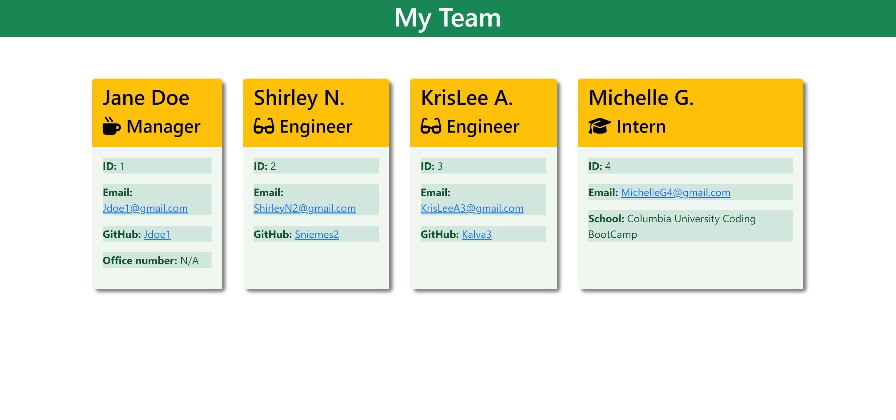

# Team Profile Generator

## 

## Visuals: 

## Description:
- This application allows users to input their employee's information, (Manager, Engineer, and Itern) 

## Table of Contents:
* [User Story](#user-story)
* [Acceptance Criteria](#acceptance-criteria)
* [Mock-up](#visuals)
* [Description](#description)
* [License](#licensehttpsimgshieldsiobadgelicense-apache20-bluesvghttpsopensourceorglicensesapache-20) 
* [Installation](#installation)
* [Usage](#usage)
* [Contributing](#contributing)
* [Tests](#tests)
* [Contact Informations](#contact-informations)
* [Demo](#demo)

## User Story:

## Acceptance Criteria:

## Installation:
- Use inquirer, fs, jest, and path 
- First, install "<b>inquirer</b>", and use  "<b>npm i inquirer@8.2.4</b>"
- Open your VS Code
- Open Terminal, and use the following command: "<b>node index.js</b>"

## Usage:
- To use this application, install the dependecies then run the app in the terminal on VS Code. 

## Contributing:
- N/A

## Tests:
- Node.js and Jest

## Contact Informations:
* GitHub Username: <a href="https://github.com/TiffyAlva">TiffyAlva</a>
* Email: <a href="malito:TiffanyAlvarez54@gmail.com">TiffanyAlvarez54@gmail.com

## Demo

